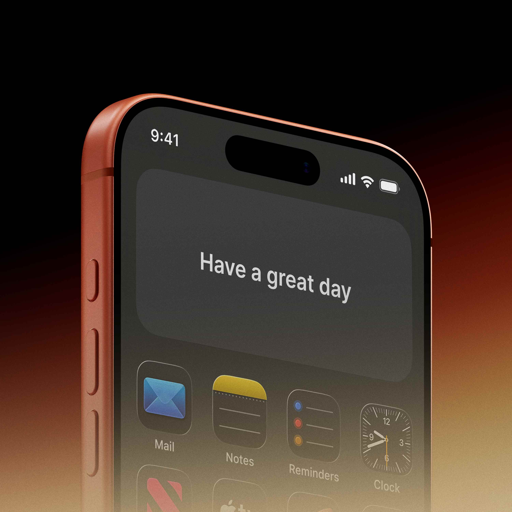
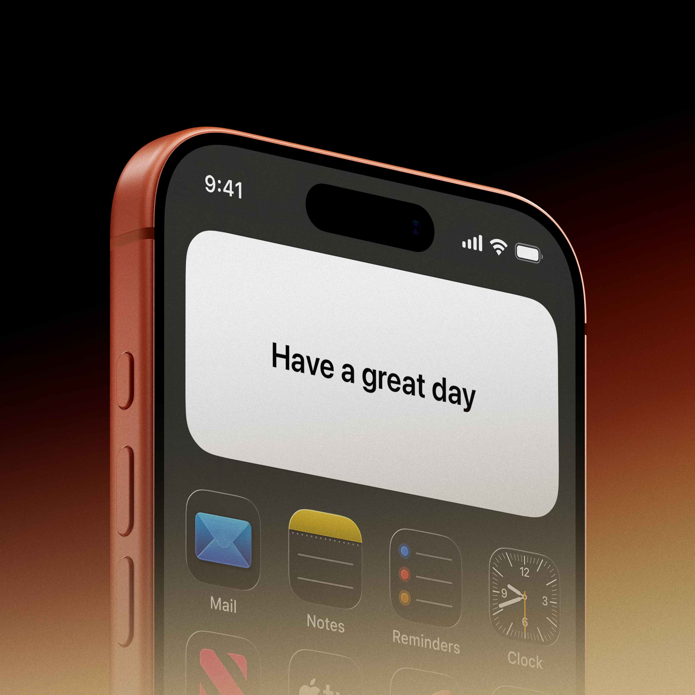

# 💌 Message Widget for iOS

A clean, minimal iOS widget that displays the latest message from your loved one using Supabase as a backend. Perfect for couples who want a simple way to stay connected throughout the day.


*Dark mode version of the widget*


*Light mode version of the widget*

---

## ✨ Features

- **Clean Minimal Design**: No distractions, just the message
- **Automatic Dark Mode**: Switches to dark theme from 9 PM to 6 AM
- **Responsive Layout**: Optimized for all widget sizes (small, medium, large)
- **German Greetings**: Time-based German greetings (optional)
- **Real-time Updates**: Fetches latest messages automatically
- **Easy Setup**: Simple configuration with Supabase backend

## 📱 Widget Preview

| Small Widget | Medium Widget | Large Widget |
|-------------|--------------|--------------|
|  |  |  |

---

## 🚀 Quick Start

### 1. Prerequisites

- **iOS 14 or later**
- **[Scriptable](https://apps.apple.com/us/app/scriptable/id1405459188)** app installed from the App Store
- A free **[Supabase](https://supabase.com)** account

### 2. Database Setup

1. **Create a new Supabase project**
   - Go to [Supabase Dashboard](https://app.supabase.com)
   - Click "New Project"
   - Choose a name and secure password
   - Note your **Project URL** and **anon public key** (you'll need these later)

2. **Create the messages table**
   - In your Supabase project, go to **Table Editor** → **Create a new table**
   - Name the table: `messages`
   - Add these columns:
     - `id` (type: int8, Primary Key, Is Identity: true)
     - `text` (type: text, Nullable: false)
     - `created_at` (type: timestamptz, Default: `now()`)
     - `updated_at` (type: timestamptz, Default: `now()`)

3. **Enable Row Level Security (RLS)**
   - Go to **Authentication** → **Policies**
   - Click "Enable RLS" for the messages table
   - Create a new policy:
     - Policy Name: "Allow public read access"
     - Using expression: `true`
     - For: `SELECT` operations only

4. **Insert a test message**
   ```sql
   INSERT INTO messages (text) VALUES ('Hello! Thinking of you today.');
   ```

### 3. Widget Installation

1. **Copy the widget code**
   - Open Scriptable app on your iPhone
   - Tap the "+" button to create a new script
   - Paste the code below
   - Update the configuration variables with your Supabase details

2. **Configure the widget**
   ```javascript
   // ====================
   // CONFIGURATION
   // ====================
   const SUPABASE_URL = "https://your-project.supabase.co";  // Your Supabase URL
   const SUPABASE_KEY = "your-anon-public-key-here";         // Your anon public key
   const NAME = "PartnerName";                               // Optional: Leave empty for no greeting
   ```

3. **Add to Home Screen**
   - Long-press on your home screen
   - Tap the "+" button in the top-left corner
   - Search for "Scriptable"
   - Choose your preferred widget size (small, medium, or large)
   - Tap the widget, then choose your script

---

## 📁 Full Widget Code

```javascript
// ====================
// MESSAGE WIDGET
// ====================

// CONFIGURATION
const SUPABASE_URL = "https://your-project.supabase.co";
const SUPABASE_KEY = "your-anon-public-key-here";
const NAME = "PartnerName"; // Optional: Leave empty for no greeting

const ENDPOINT = "/rest/v1/messages?select=text&order=updated_at.desc&limit=1";

async function fetchLatestMessage() {
  try {
    const req = new Request(SUPABASE_URL + ENDPOINT);
    req.method = "GET";
    req.headers = {
      "apikey": SUPABASE_KEY,
      "Authorization": "Bearer " + SUPABASE_KEY,
      "Content-Type": "application/json"
    };

    const json = await req.loadJSON();
    return json[0]?.text || null;
  } catch (error) {
    console.error("Error fetching message:", error);
    return null;
  }
}

function isNightMode() {
  const hour = new Date().getHours();
  return hour >= 21 || hour < 6;
}

function getGermanGreeting() {
  const hour = new Date().getHours();
  if (hour >= 5 && hour < 12) return "Guten Morgen";
  if (hour >= 12 && hour < 18) return "Guten Tag";
  if (hour >= 18 && hour < 22) return "Guten Abend";
  return "Gute Nacht";
}

async function createWidget() {
  const message = await fetchLatestMessage();
  const nightMode = isNightMode();

  let widget = new ListWidget();
  widget.backgroundColor = nightMode ? new Color("#121212") : new Color("#FFFFFF");
  
  // Detect widget size
  const isMediumWidget = !config.runsInApp && config.widgetFamily === "medium";
  const isLargeWidget = !config.runsInApp && config.widgetFamily === "large";
  
  // Add greeting if name is set
  if (NAME) {
    let greeting = widget.addText(`${getGermanGreeting()}, ${NAME}`);
    greeting.font = Font.mediumSystemFont(12);
    greeting.textColor = nightMode ? new Color("#AAAAAA") : new Color("#666666");
    widget.addSpacer(6);
  }
  
  // Display message
  if (message) {
    let messageText = widget.addText(message);
    
    // Font size based on widget size
    if (isLargeWidget) {
      messageText.font = Font.systemFont(18);
    } else if (isMediumWidget) {
      messageText.font = Font.systemFont(17);
    } else {
      messageText.font = Font.systemFont(15);
    }
    
    messageText.textColor = nightMode ? new Color("#FFFFFF") : new Color("#000000");
    messageText.lineLimit = 0;
    
    // Center text in medium/large widgets
    if (isMediumWidget || isLargeWidget) {
      messageText.centerAlignText();
    }
  } else {
    let placeholder = widget.addText("No messages yet");
    placeholder.font = Font.systemFont(14);
    placeholder.textColor = nightMode ? new Color("#AAAAAA") : new Color("#888888");
    
    if (isMediumWidget || isLargeWidget) {
      placeholder.centerAlignText();
    }
  }

  // Adjust padding based on widget size
  if (isLargeWidget) {
    widget.setPadding(22, 22, 22, 22);
  } else if (isMediumWidget) {
    widget.setPadding(18, 18, 18, 18);
  } else {
    widget.setPadding(14, 14, 14, 14);
  }

  return widget;
}

// ====================
// EXECUTION
// ====================
let widget = await createWidget();

if (config.runsInWidget) {
  Script.setWidget(widget);
} else {
  widget.presentMedium();
}

widget.refreshAfterDate = new Date(Date.now() + 15 * 60 * 1000);
Script.complete();
```

---

## 🔧 Customization

### Change Colors
Modify these lines in the code:
```javascript
// For day mode:
widget.backgroundColor = new Color("#FFFFFF");  // Background
messageText.textColor = new Color("#000000");   // Text color

// For night mode:
widget.backgroundColor = new Color("#121212");  // Background
messageText.textColor = new Color("#FFFFFF");   // Text color
```

### Adjust Font Sizes
```javascript
// Small widget
messageText.font = Font.systemFont(15);

// Medium widget  
messageText.font = Font.systemFont(17);

// Large widget
messageText.font = Font.systemFont(18);
```

### Change Refresh Interval
The widget updates every 15 minutes by default. To change this:
```javascript
// Update every 5 minutes:
widget.refreshAfterDate = new Date(Date.now() + 5 * 60 * 1000);

// Update every hour:
widget.refreshAfterDate = new Date(Date.now() + 60 * 60 * 1000);
```

### Remove Greeting
If you don't want the greeting, either:
1. Set `NAME = ""` in the configuration, or
2. Remove this section from the code:
   ```javascript
   if (NAME) {
     let greeting = widget.addText(`${getGermanGreeting()}, ${NAME}`);
     // ... rest of greeting code
   }
   ```

---

## 🌐 Sending Messages

### Via Supabase Dashboard
1. Go to your Supabase project
2. Navigate to **Table Editor** → **messages**
3. Click "Insert row"
4. Enter your message in the `text` field
5. Click "Save"

### Via REST API
```bash
curl -X POST 'https://YOUR_PROJECT.supabase.co/rest/v1/messages' \
  -H "apikey: YOUR_ANON_KEY" \
  -H "Authorization: Bearer YOUR_ANON_KEY" \
  -H "Content-Type: application/json" \
  -d '{"text": "Your message here"}'
```

### Simple Web Interface
Create an HTML file like this:
```html
<!DOCTYPE html>
<html>
<body>
  <input id="message" placeholder="Enter message">
  <button onclick="sendMessage()">Send</button>
  
  <script>
    async function sendMessage() {
      const message = document.getElementById('message').value;
      await fetch('https://YOUR_PROJECT.supabase.co/rest/v1/messages', {
        method: 'POST',
        headers: {
          'apikey': 'YOUR_KEY',
          'Authorization': 'Bearer YOUR_KEY',
          'Content-Type': 'application/json'
        },
        body: JSON.stringify({ text: message })
      });
      alert('Message sent!');
    }
  </script>
</body>
</html>
```

---

## 🔒 Security Notes

- The widget uses Supabase's **anon public key** which only allows reading messages
- For additional security, you can:
  1. Enable email authentication in Supabase
  2. Create a secure API endpoint for sending messages
  3. Add rate limiting to prevent abuse
- The anon key is exposed in the widget code - this is acceptable for personal use but consider additional security for public apps

---

## ❓ Troubleshooting

### Widget shows "No messages yet"
1. Check your Supabase URL and API key are correct
2. Verify you have messages in the `messages` table
3. Ensure Row Level Security allows SELECT operations

### Widget doesn't update
1. Scriptable widgets refresh every 15 minutes minimum
2. Try removing and re-adding the widget
3. Restart the Scriptable app

### German greetings incorrect
The greetings are based on your device's local time. Check your iPhone's time zone settings.

---

## 📝 License

This project is licensed under the MIT License - see the [LICENSE](LICENSE) file for details.

---

## 🙏 Acknowledgments

- **[Scriptable](https://scriptable.app/)** - iOS automation app that makes this widget possible
- **[Supabase](https://supabase.com/)** - Open source Firebase alternative for the backend
- Inspired by the simple need to stay connected with loved ones

---

## 🤝 Contributing

Found a bug or have an improvement? 
1. Fork the repository
2. Create a feature branch
3. Make your changes
4. Submit a pull request

---

**Made with ❤️ for meaningful connections**

*If this project helped you, consider giving it a star!*
